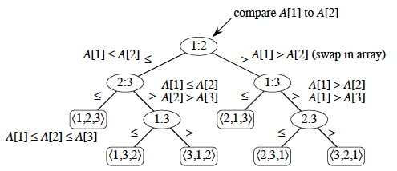

# 1. **Introduction to Coremen**
Hi Everyone, I am Harsh Vijay.

This is my attempt to learn and improve my Data Structures and Algorithms. I am learning from book which is considered to be the Geeta for DSA and computer science **Introduction to Algorithm**.

This is a really great book and also one of the most recommended, I have tried earlier to learn from this got partial success but was not able to complete it fully, hence attempting this again. 

This time I am maintaining this repo, this serves multiple purposes, some of them are.

- This serve as a record in which I can track my daily progress, my aim is to never miss reading the book on any day, but if that ever come I will record that too.
- This will come useful in future for revision purposes. A small simple explanation with implementaton and images if suitable, I think this is will be enough.
- This help me motivate to learn everyday. In the morning after I read the next concepts from the book, it takes me 15~20 minutes to udpate this repo and I like regularly updating my progress and see myself grow. This is my reward for learning daily. I learned this technique from the book **Atomic habit** and aiming to get better 1% everyday with this.
- In case I get success, I will share this method/technique with other and utilize it more for myself.

 
# 2. **Table of Content**

- [1. **Introduction to Coremen**](#1-introduction-to-coremen)
- [2. **Table of Content**](#2-table-of-content)
- [3. **Algorithms**](#3-algorithms)
- [4. **Data Strucutres**](#4-data-strucutres)
- [5. **Learning from Coremen book.**](#5-learning-from-coremen-book)
  - [5.1. **Day 1 [04/04/2022]**](#51-day-1-04042022)
    - [5.1.1. **Learned why algorithms are technology.**](#511-learned-why-algorithms-are-technology)
    - [5.1.2. **Revised Insertion Sort**](#512-revised-insertion-sort)
  - [5.2. **Day 2[05/04/2022]**](#52-day-205042022)
    - [5.2.1. **Revised how prove the completness of an algorithm**](#521-revised-how-prove-the-completness-of-an-algorithm)
    - [5.2.2. **Revised Merge sort**](#522-revised-merge-sort)
    - [5.2.3. **Revised Divide and Conqure paradigm.**](#523-revised-divide-and-conqure-paradigm)
  - [5.3. **Day 3 [06/04/2021]**](#53-day-3-06042021)
    - [5.3.1. **Revised Asymtotic Notation**](#531-revised-asymtotic-notation)
      - [5.3.1.1. **Theta Notation (Θ-notation)**](#5311-theta-notation-θ-notation)
      - [5.3.1.2. **Big Oh Notation (O-notation)**](#5312-big-oh-notation-o-notation)
      - [5.3.1.3. **Omega Notation (Ω-notation)**](#5313-omega-notation-ω-notation)
    - [5.3.2. **Divide and Conquer.**](#532-divide-and-conquer)
    - [5.3.3. **Maximum subarray problems**](#533-maximum-subarray-problems)
  - [5.4. **Day 4 [07/04/2021]**](#54-day-4-07042021)
    - [5.4.1. **Straseen's Matrix**](#541-straseens-matrix)
    - [5.4.2. **How to solve recursion and find complexity**](#542-how-to-solve-recursion-and-find-complexity)
      - [5.4.2.1. **Substitution Method**](#5421-substitution-method)
      - [5.4.2.2. **Tree Method**](#5422-tree-method)
      - [5.4.2.3. **Master Theorem**](#5423-master-theorem)
  - [5.5. **Day5 [08/04/2020]**](#55-day5-08042020)
    - [5.5.1. **Heap**](#551-heap)
      - [5.5.1.1. **Max Heap**](#5511-max-heap)
      - [5.5.1.2. **Min Heap**](#5512-min-heap)
    - [5.5.2. **Methods of a Heap**](#552-methods-of-a-heap)
      - [5.5.2.1. **Max-heapify(A, i)**](#5521-max-heapifya-i)
      - [5.5.2.2. **Build-Max-heap(A)**](#5522-build-max-heapa)
    - [5.5.3. **Sorting using heap**](#553-sorting-using-heap)
  - [5.6. **Day 6 [09/04/2022]**](#56-day-6-09042022)
    - [5.6.1. **Priority Queue**](#561-priority-queue)
    - [5.6.2. **Methods of Max_heap**](#562-methods-of-max_heap)
      - [5.6.2.1. **Heap_maximum**](#5621-heap_maximum)
      - [5.6.2.2. **Heap_extract_max**](#5622-heap_extract_max)
      - [5.6.2.3. **Heap_increase_key**](#5623-heap_increase_key)
      - [5.6.2.4. **Max_heap_insert**](#5624-max_heap_insert)
  - [5.7. **Day 7 [10/04/2022]**](#57-day-7-10042022)
    - [5.7.1. **Quick Sort**](#571-quick-sort)
    - [5.7.2. **Time complexity**](#572-time-complexity)
    - [5.7.3. **Randomised Quick sort**](#573-randomised-quick-sort)
  - [5.8. **Day 8 [11/04/2022]**](#58-day-8-11042022)
    - [5.8.1. **Comparison sorts**](#581-comparison-sorts)
    - [5.8.2. **Lower bound for comparison sort.**](#582-lower-bound-for-comparison-sort)
    - [5.8.3. **Counting Sort**](#583-counting-sort)
    - [5.8.4. **Radix sort**](#584-radix-sort)
  - [5.9. **Day 9 [12/04/2022]**](#59-day-9-12042022)
    - [5.9.1. **Bucket Sort**](#591-bucket-sort)
    - [5.9.2. **Iᵗʰ order statistics**](#592-iᵗʰ-order-statistics)
      - [5.9.2.1. **Sorting**](#5921-sorting)
      - [5.9.2.2. **Quick Select**](#5922-quick-select)
      - [5.9.2.3. **Partition**](#5923-partition)
  - [5.10. **Day 10 [13/04/2022]**](#510-day-10-13042022)
    - [5.10.1. **Data Strucutres**](#5101-data-strucutres)
      - [5.10.1.1. **Common methods**](#51011-common-methods)
    - [5.10.2. **Elementary Data Structure**](#5102-elementary-data-structure)
      - [5.10.2.1. **Stacks**](#51021-stacks)
  - [**Day 11 [14/04/2022]**](#day-11-14042022)
    - [**Elementary Data Structure**](#elementary-data-structure)
      - [**Linked List**](#linked-list)
  

# 3. **Algorithms**

| Name  |Time Complexity   |Space Complexity   |Link   | Day|
|---|---|---|---|---|
| Insertion Sort | O(n^2)   |O(1)   | [Inserion Sort](./Algos/InsertionSort.py)  |Day1|
| Merge Sort | O(n^2)   |O(n)   | [Merge Sort](./Algos/MergeSort.py)  |Day2|
| Maximum Subarray Recusive | O(nlog(n))   |O(1)   | [Maximum Subarray](./Algos/MaximumSubarray.py)  |Day3|
| Maximum Subarray Linear | O(n)   |O(1)   | [Maximum Subarray](./Algos/MaximumSubarray.py)  |Day3|
| Quick Sort | O(nlog(n))   |O(1)   | [Quick Sort](./Algos/quicksort.py)  |Day7|
| Counting Sort | O(n)   |O(n)   | [Counting Sort](./Algos/countingSort.py)  |Day8|
| Radix Sort | O(n*d*))   |O(1)   | [Quick Sort](./Algos/radixSort.py)  |Day8|
| ith order statistic | O(nlogn))   |O(1)   | [sorting Select](./Algos/ith_order_statistics.py)  |Day9|
| Quick Select | O(logn))   |O(1)   | [Quick Select](./Algos/quick_select.py)  |Day9|

# 4. **Data Strucutres**


|Name  |Link  |Day |
|---------|---------|---------|
|Heap     | [max heap](DataStructure/Heap.py)       | Day 5        |
|Priority Queue     | [max priority queue](DataStructure/PriorityQueue.py)       | Day 6        |

# 5. **Learning from Coremen book.**

## 5.1. **Day 1 [04/04/2022]**
Started Coremen from begining.

### 5.1.1. **Learned why algorithms are technology.**
Alogrithm are technology becuase just like using the right technology can save a lot of effort, time and resources. Using the right algorithm help us achive the same. As technology grows and evolve so does Algorihtms.

### 5.1.2. **Revised Insertion Sort**
Insertion sort is one of the most basic sorting algorithm. This is a incremental based algorithm.

In this the key A[n] is inserted in the already sorted array A[1..n-1] so that the array A[1..n] is sorted.


## 5.2. **Day 2[05/04/2022]**
### 5.2.1. **Revised how prove the completness of an algorithm**

Following three needs to be insured to prove completness of a algorithm 
1. Initialization
2. Maintenance
3. Termination
   
### 5.2.2. **Revised Merge sort**
Merge sort is an divied and conqure based sorting algorithm, which has time complexity of O(nlog(n)) and space complexity of O(n).

### 5.2.3. **Revised Divide and Conqure paradigm.**
Divide and conqure is one of the most used paradigm to solve problems in programming.<br>
It relies on the recursion to divide the problem into subsets, solve them and combine the result of all the subset to provide the solution of the problem.<br>
Recursion time complexity is solved using the Master theorem or Tree method, I  prefer the Tree method.


## 5.3. **Day 3 [06/04/2021]**

### 5.3.1. **Revised Asymtotic Notation**

In real world the exact precision of what is the runtime of an algorithms are not required.<br>
Rather we use we express the effeciency or runtime of an algorithm based on the suffecient large number of input sizes to make only the growth of runtime relevant. We study the asymtotic efficiency of the algorithm. 

We mostly use 3 type of notations to express algorithm.

####  5.3.1.1. **Theta Notation (Θ-notation)**

For a function f(n) its time complexity is Θ(g(n))<br>
If and only if there exist two values c1 and c2 for all values of n greater than n' such that:<br>
c1*g(n) <= f(n) <= c2*g(n),  Where n >= n' <br>

This basically means that the function f is sandwiched between function g for suffeciently large n. Refer below image for more clear explanation.


####  5.3.1.2. **Big Oh Notation (O-notation)**

For a function f(n) its time complexity is O(g(n))<br>
If and only if there exist one value c1 for all values of n greater than n' such that:<br>
f(n) <= c1*g(n),  Where n >= n' <br>

This basically means that the function f is lower than g for suffeciently large n.

> Note: This means a function f(n) = n have O(n^2) complexity

Negative potential consequences of an action
Refer below image for more clear explanation.

 

####  5.3.1.3. **Omega Notation (Ω-notation)**

For a function f(n) its time complexity is O(g(n))<br>
If and only if there exist one value c1 for all values of n greater than n' such that:<br>
c1*g(n) <= f(n)  ,  Where n >= n' <br>

> Note: This means a function f(n) = n^2 have Ω(n) complexity

This basically means that the function f is greater than g for suffeciently large n. Refer below image for more clear explanation.

    


### 5.3.2. **Divide and Conquer.**
Revied the divide and conque paradigm in chapter 4.

Divide and conquer have mainly 3 parts. 
1. Divide: the problem into a number of subproblems that are smaller instances of the same problem.
2. Conquer: the subproblems by solving them reccursively. If the subproblem sizes are small enough then just solve the subproblems in a straightforward manner.
3. Combine: the solutions to the subproblems into the solution for the original problem.
   
### 5.3.3. **Maximum subarray problems**
Revised the maximum subarray problem and learned the three ways to solve it.
1. Brute force method having O(n^2) complexity
2. Divide and Conquer method having O(nlogn) complexity
3. Incremental method having O(n) complexity 

## 5.4. **Day 4 [07/04/2021]**

### 5.4.1. **Straseen's Matrix**
This is a matrix multiplication algorithm which is based on divide and conqure paradigm, In this the original matrix is divide into 4 equall parts and then the resulting matrix is calulated using some formulas.

But rather than having 8 n*n multiplications it only does 7 and hence get an time compleity of O(n^ln(7)) lesser then O(n^3).

I dont understand it properly and will come back to it again if required.

### 5.4.2. **How to solve recursion and find complexity**

There are three method to solve recursions.

#### 5.4.2.1. **Substitution Method**
In this we first guess what might be the complexity of the algorithm and based on that we prove that it might be right using mathematical induction.

#### 5.4.2.2. **Tree Method**
This is not exacly a method to find the complexity of the algorithm but it help us at guessing what it might be. This is a visual way in which we represent the recurssion in the form of a tree.

For example:

> For a recurssion  T(n) = a*T(n/b) + f(n)
> 
> In the tree representation the root node is  the extra complexity attached with the i.e f(n) 
>
> The leaf nodes represent the base case generally a contant time complexity o(1) 
>
>And there are total ln(b) + 1 levels
>
> See image below for better understanding. 


We sum the cost of all the levels which is then proper guess at the time complexity of algoritm

#### 5.4.2.3. **Master Theorem**

This method is used to calculate the time complexity of a recursion in for of:<br>
>T(n) = a*T(n/b) + f(n)

It have three rules.

First make another function G(n) such that:<br>
> g(n) = n^ (logb(a))  [log a to the base b]

Now Compare g(n) and f(n)

1. If f(n) > g(n), Then the complexity if O(f(n))
2. If g(n) > f(n), Then the complexity is O(g(n))
3. Otherwise Both are same time, Then the complexity is O( log(n) * f(n) )
 

## 5.5. **Day5 [08/04/2020]**
Today I skipped chapter 5th from the book.<br>
Started Sorting and order statistics.
### 5.5.1. **Heap**
Heap is the data structure which when visualised like a balanced binary tree.

> Note: All the subtree in a heap are also a heap

There are two type of heap: Max heap and Min heap.

Heap uses three methods: Left, Right, Parent.
Each of which take an index and return the index of left node, right node and parent node correspondingly.

#### 5.5.1.1. **Max Heap**

For all the elements in the heap A, max heap insured the following property:

The A[i] >= A[left(i)] and A[i] >= A[right(i)]

Hence the maximum element in a max heap is present at the root node. 
> Note: A reverse sorted list is also and max heap


#### 5.5.1.2. **Min Heap**

For all the elements in the heap A, min heap insured the following property:

The A[i] <= A[left(i)] and A[i] <= A[right(i)]

Hence the minimum element in a min heap is present at the root node. 
> Note: A sorted list is also and max heap


### 5.5.2. **Methods of a Heap**
> Notes:
> >Here I am only mentioning method for Max heap same methods also exists for min heap as well.
>  
> >All the algorithms mentioned for heap in this are based on 1 indexing and are implemented for 0 based indexing in the DataStructure directory.

#### 5.5.2.1. **Max-heapify(A, i)**
This method asumme that the Left(i) and Right(i) subtree are also heap but the condition:

A[i] >= A[ Left(i) ] and A[i] >= A[ Right(i) ]

But be failing at index i hence the heap is not max heap.<br>
So to solve this it check the condition if it it fulfilled it does nothing otherwise get the index largest element from left or right let it be j, then swap the A[i] with A[j] and recursively call the Max-heapify index j.<br>
Algorithm for this.
```
max_heapify(array, index) ->
  largest_index = index
  left_index = left(index)
  right_index = right(index)

  if left_index <= array.size and array[left_index] > array[largest_index]:
    largest_index = left_index
  
  if right_index <= array.size and array[right_index] > array[largest_index]:
    largest_index = right_index
  
  if largest_index != index:
    swap(index, largest_index)
    max_heapify(largest_index)
```

It ensure that the condition is meet at index i.

#### 5.5.2.2. **Build-Max-heap(A)**
This method is used to create the heap meaning the condition is fulfilled at every index in the heap.

It procedure is:
```
build_max_heap(array) ->
  length = array.size
  for index from length//2 to 1:
    max_heapify(array, index)
```
This start from bottom toward up because MAx-heapify assume that the Left and Right subtree are also max-heap which will be False if we go to top to bottom.

### 5.5.3. **Sorting using heap**
Heap Structure can be for sorting as well.<br>
Logic used in this process is that:

```
heap_sort(array) -> 
  array = build_max_heap(array)
  for i from array.length to 2:
    swap(array[1], array[i])
    array.size -= 1
    max_heapify(array, 1)
```
Heap sort has time complexity of O(nlog(n)) but a better implementation of qiuck sort has lower constant coeffecient hence resulting in faster performance.<br>

## 5.6. **Day 6 [09/04/2022]**

### 5.6.1. **Priority Queue**
Heap is an amazing data structure and can also be used to implement priority queue which have many use cases such as job scheduling based on priorty, etc.

Same as heap priorty queue is also of 2 types:
1. Max priority queue
2. Min priority queue
   
Here I am only explaining max priority but on similar basis min prority can also be implemented.

### 5.6.2. **Methods of Max_heap**
> Note:
> > The algos shown in the document are based on 1 based indexing and are implemented on 0 based indexing in the DataStructure directory.

#### 5.6.2.1. **Heap_maximum**
This method return the maximum priority item in the queue.

Algo:
```
heap_max(a) -> 
  return a[1]
```

#### 5.6.2.2. **Heap_extract_max**
This method pop the maximum priority item in the queue and also remove it from the queue.

Algo:
```
heap_extract_maximum(a) ->
  maximum = a[1]
  swap(a[1], a[a.size])
  a.size -= 1
  max_heapify(a, 1)
  return max
```

#### 5.6.2.3. **Heap_increase_key**
This method increase the key of an item at index.

Algo:
```
heap_increase_key(a, i, k):
  if k < a[i]:
    Error "Key is smaller can't insert"
    exit

  while i > 1 and a[parent(i)] < k:
    a[i] = a[parent(i)]
    i = parent(i)
  a[i] = k
```

#### 5.6.2.4. **Max_heap_insert**
This method is used to insert a new item in the heap.

Algo:
```
max_heap_insert(a, key):
  a.size += 1
  a[a.size] = -inf
  heap_increase_key(a, a.size, key)
```

## 5.7. **Day 7 [10/04/2022]**
Today I revised quick sort algorithm.<br>
Coremen goes in really dept for quick sort and explains all possible cases for it.<br>
However I have only read till randomised quick sort as I found out that is it suffecient enough for me now.

### 5.7.1. **Quick Sort**
Quick Sort is one of the most used and most preffered sorting algithm beacause when implemented properly, It have an time complexity of O(nlogn) which is similar to merge sort and heap sort but in this case the constant coffecient is really small beating heap sort and it is an in place sorting algorihtm hence only takes O(1) auxilary space beating merge sort.

Quick Sort is based on the divide and conquer paradigm.<br> 
In this the array A[p..r] is divided into two partitions A[p..q-1] and A[q+1..r] such that all the elements in the partition A[p..q-1] are <= to A[q] and all the elements in partition A[q+1..r] are > A[q] and the item A[q] is termed as the pivot.

The recurrence for quick sort best case is:
```
T(n) = 2T(n/2) + O(n)
```

> Note: The algorithm mentioned in this doc are 1 based indexing while implemented in on 0 based indexing in the Algos directory. 

Algo 
```
quicksort(A, p, r) ->
  if p < r:
    q = partition(A, p, r)
    quicksort(A, p, q-1)
    quicksort(A, q+1, r)

```

Here the method Partition have Θ(n) time complexity.

Algo for Partition

```
partition(A, p, r) ->
  key = A[r]
  j = p
  
  while j < r:
    j += 1
    if A[j] <= key:
      i += 1
      swap(A, i, j)
  swap(A, i+1, r)
  return i+1 
```

### 5.7.2. **Time complexity**
The time complexity of quick sort for an average and best case is O(nlogn), while for the worst case is O(n²).

The worst case of quick sort occur when the input array is already sorted order {reverse sorted will also result in worst case}.<br>
This occur due to the partition method creating unbalanced partitions of the array. of size 1 and n-1, In which same will continue and will result in the following recurrence.
```
T(n) = T(n-1) + O(n)
```
Which when solved result in O(n^2) complexity.<br>

Here when facing a problem of sorting in which the array is in partially sorted order **Insertion sort** will be more preferable resulting in faster sorting than quick sort.

### 5.7.3. **Randomised Quick sort**
Randomised quick sort aims to minimize the possiblity of worst case for quick sort by randomly chosing the pivot from the array. Hence even in the sorted input the chances of partition method creating more balanced partitions incresed resulting in lesser time complexity.

Algo:
```
randomised_quicksort(A, p, r)->   
  i = random(p, r)
  swap(A, i, r)
  q = partition(A, p, r)
  randomised_quicksort(A, p, q-1)
  randomised_quicksort(A, q+1, r)
```

## 5.8. **Day 8 [11/04/2022]**
Today I started the chapter 8 **Sorting in Linear time**

### 5.8.1. **Comparison sorts**

All the sorting algorithm I have learned or revised till now are comparison sorting algotihm, as they use comparison to find the order of elements in the array.

### 5.8.2. **Lower bound for comparison sort.**

The lower bound of all the comparsion sort will be of Ω(nlogn). This can be proved via decision tree.<br>
In the decision tree at every node a comparison is made to find the relative order of the item [This is only for decision tree of comparision sort.]<br>
See image below for better understanding.



The number of leafs of the tree are the total possible permutation of the input array.
The time taken to sort the input will be equall to the time taken to make h comparisions in the tree where h is the height of the node having reachable leaf

Now, Suppose there are n intergers to be sorted using comparison sort. So there will be an total of n! possible permutation of the input.

Let us assume that the decision tree for this input have and height of h.<br>
Since a tree of height h have 2ʰ leafs and all the leafs are a upper bound on total possible permutations 
```
n! <= 2ʰ
Taking log both the side.

log(n!) >= h 
h <= log(n!)
h <= Ω(nlog(n)) : This is by the equation 3.19 on page 58 in the book.
```

Hence any sorting algorithm have an lower bound of Ω(nlog(n)) the constant may change but the boundation will be there.

### 5.8.3. **Counting Sort**

Counting sort is an non comparision sorting algorithm which assumes that the input are integer only and that they are in range 0 to n. If both the assumptions correct than the counting sort can sort an array in O(n) time.

It does this by couting the number of item less that i and using this value it find the correct index of item.

Counting sort have time complexity of O(n) and have space complexity of O(n) as well.
It is also an stable sorting algorithm.

Algo:

```
counting_sort(A, b, k) -> 
  Create a new array of length k and initialize it with 0 at every index.

  for item in A:
    C[A] += 1
  
  for i in 2 to k:
    C[i] += C[i-1]
  
  for i in from A.length to 1:
    b[C[A[i]]] = A[i]
    C[A[i]] -= 1

```

### 5.8.4. **Radix sort**
Similar to counting sort radix sort is also an non comparision based sorting algoritm.

This algorithm is used to sort keys having d digits by using an stable sort.<br>
It sort the keys by first sorting the digits having lower priority then the digits have higher priority and soo on.

Alog:

```
radix_sort(A,d):
  for i for 1 to d:
    use any stable sort for sorting A by the digits at i
```

The sorting algotihtm can also be used to sort the dates by first sorting the day then month and in last by year.

The time complexity of radix sort is O(d*n) where d is the numbers of digits and n is the number of items.
It require a stable to maintaing the relative ordering of similar keys.

## 5.9. **Day 9 [12/04/2022]**

### 5.9.1. **Bucket Sort**
Bucket sort assumes that the input is drawn form an uniform distribution and has an average running time of O(n).
Like counting sort bucket sort is fast as it assume something about the input.

Bucket sort divide the interval [01) into n equall-sized sub intervals, or buckets and hten distributes the n input numbers into teh buckets. Since the inputs are uniformy distributed over [0,), we don not expect many numbers to fall into same bucket.

To produce the output, we simply sort the numbers in each bucket and then go throught bucket in order, listing the elements in each.

Algo:
```
bucket_sort(A) ->
  n = A.length
  B = [ list() for i from 1 to n] // B is an list containing n empty lists.

  for i from 1 to n:
    B[n*A[i]].add(A[i])
  
  for i from i to n:
    sort the list B[i] using insertion sort.
  
  combine all the list of B together to create the sorted list.
```

This sorting is quite different as it makes many assumption about the input, but the anyu input can be easily converted into the required input by dividing the elements by maxuimum of elements + 1.
and after sorting again multiply the sorted elements by (maximum + 1)

### 5.9.2. **Iᵗʰ order statistics**
The iᵗʰ order statistics is a problem in which we have to return the iᵗʰ smallest element from the input elements.

There are 3 approch for this problem

#### 5.9.2.1. **Sorting**
The very simple and and easy way to solve this problem is to simply sort the elements in increasing order and return the iᵗʰ index element.

This is pretty straight forward solution and has a time complexity of O(nlogn). Assuimg comparion based sort.

Algo
```
select(A, i) ->
  sort the array A
  return A[i]
```

But we can do better and solve this problem in O(n) time complexity.

#### 5.9.2.2. **Quick Select**

This approch is based on the divide and conquer paradigm and is heavily inspired by the quick sort, hence it is also known as quick select.

Like in quick sort as we parition the array into two part using the Parition method. But unlike quick sort we only recursivley call on one partition based on the partition index.

Algo
```
quick_select(A, s, e, k) ->
  if s == e:
    return A[s]
  
  q = Partition(A, s, e)
  i = q-s+1
  if k == i:
    return A[k]

  if k > i :
    return quick_select(A, q+1, e, k-i) 
  else:
    return quick_select(A, s, q-1, k)
```

#### 5.9.2.3. **Partition**
This method similar to quick select divide the input into partition to find the iᵗʰ order statistics.

Its Algo According to book.

```
partition_select(A, i):
  1. Divide the n elemets into partitons of size n//5 + 1 is n % 5 != 0.
  2. Find the median of all the partitons.
  3. Pick the median from the median of all the partitions let it be x.
  4. Partiton the input arrays around the medians of the medians using the Partition method of quick sort. Let it be j.
  5. if j = i return x. otherwise slect recursively to find the iᵗʰ smallest element on the low side is i < k or the (i-k)ᵗʰ smallest element on the higher side if i > k
```

## 5.10. **Day 10 [13/04/2022]**

Today I started the part III of the book.<br>
Today I was not able to make much progress, due to some personal tasks.<br>
But will make sure that I cover that up tommorow.

### 5.10.1. **Data Strucutres**

Basically A data structure is an way to organize and store data in such a way that it provide and effecient, east and fast method to access and manipulate the data.

#### 5.10.1.1. **Common methods**
Some common methods for Data strucutre are.
1. Search(x): Search the item x in the dataset
2. Insert(x): Insert the item x in the dataset.
3. Delete(x): Delete the item x in the dataset.  
4. Minimum(): Return the item with minimum value from the dataset.
5. Maximum(): Return the item with maximum value from the dataset.
6. Succesor(x): Return the item from to the next larger item than x from dataset.
7. Predecessor(x): Return the item from to the next smaller item that x from dataset.
   
### 5.10.2. **Elementary Data Structure**

#### 5.10.2.1. **Stacks**
Similar to an array stacks are linear data stucture in which all the operations are performed on one end, known as top of the stack.
Stack implements LIFO policy (Last in first out)

Stacks support 3 operations.
1. Is_empty(): Return true if stack is empty
2. Is_full(): Return true if stack is full.
3. Push(x): Add item x in the stack.
4. Pop(): Removes and return the topmost element from the stack.
   
Algo:

> Note: 
> >Here I am assuming that the method does not require pointer to stack object on which operations are performed, this is possible by make a class stack and creating method in that class. This is done in python using the self keyword to access the currrent object but for simplicity I have removed it from the algorithm.


```
Algoritm to implement stack methods.

is_empty():
  if stack.top = 0
    return true
  return False

is_full():
  if stack.top() = stack.length
    return true
  return false

push(x):
  if is_full():
    error "stack overflow"
  stack.top += 1
  stack[stack.top] = x

pop():
  if is_empty():
    error " Stack underflow"
  stack.top -= 1
  return stack[stack.top+1]
```

## **Day 11 [14/04/2022]**

Today I continued with elementary data structure and revised linked list.

### **Elementary Data Structure**

#### **Linked List**
Same as array and stacks and queue a linked list is also an linear data structure.
But unlike array where the linear order is determine by the indices, here it is determine by the pointers.

In simple term a linked list is a sequence of nodes connected by pointer to each other.

There are multiple type of linkedlist such as Single Linked List, Double Linked list, Circular linked list and some more.

The method implementation for operations on them differs from one another, for sake of simplicity I am showing only Singly linked list implementations.


Methods for Linked List:
1. List_search(x: val): return the node having key x from the linked list.
2. Insert(x: val): Insert a new node with value x at the begining of the List.
3. Delete(n: node): Remove node n from the list.
   
Algorithm for single Linked List.
```
Basic representation of node object.

Node:
  val = 0
  next = None

list_search(x):
  
  while x != None and x.val != x:
    x = x.next
  
  return x

insert(x):
  x.next = list.head
  list.head = x

delete(x):
  if list.head == None:
    error "List is empty"
  
  if list.head == x:
    list.head = list.head.next
  else:
    temp = list.head
    while temp and temp.next != x:
      temp = temp.next

    temp.next = x.next
```